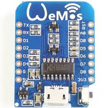

# ESP8266 based projects
[](https://travis-ci.org/aenniw/wemos_d1)

IRremote ESP8266 Library credentials goes to [GitHub](https://github.com/markszabo/IRremoteESP8266)

[Datasheet](https://espressif.com/sites/default/files/documentation/0a-esp8266ex_datasheet_en.pdf) | 
[RTOS API](https://espressif.com/sites/default/files/documentation/20b-esp8266_rtos_sdk_api_reference_v1.4.0_0.pdf) | 
[RTOS programing guide](https://espressif.com/sites/default/files/documentation/20a-esp8266_rtos_sdk_programming_guide_en.pdf)




| Wemos D1  | ESP-8266 | Value | Function                      |
|:---------:|:--------:|:-----:|:------------------------------|
| TX        | TXD      | 1     | TXD                           |
| RX        | RXD      | 3     | RXD                           |
| A0        | A0       | 17    | Analog input, max 3.3V input  |
| D0        | GPIO16   | 16    | IO                            |
| D1        | GPIO5    | 5     | IO, SCL                       |
| D2        | GPIO4    | 4     | IO, SDA                       |
| D3        | GPIO0    | 0     | IO, 10k Pull-up               |
| D4        | GPIO2    | 2     | IO, 10k Pull-up, BUILTIN_LED  |
| D5        | GPIO14   | 14    | IO, SCK                       |
| D6        | GPIO12   | 12    | IO, MISO                      |
| D7        | GPIO13   | 13    | IO, MOSI                      |
| D8        | GPIO15   | 15    | IO, 10k Pull-up, SS           |
| G         | GND      | -     | Ground                        |
| 5V        | -        | -     | 5V                            |
| 3V3       | 3.3V     | -     | 3.3V                          |
| RST       | RST      | -     | Reset                         |

| Value | Reset cause                                                   |
|:-----:|:--------------------------------------------------------------|
| 0     | normal boot                                                   |
| 1     | hardware watch dog reset                                      |
| 2     | exception reset, GPIO status won’t change                     |
| 3     | software watch dog reset, GPIO status won’t change            |
| 4     | software restart ,system_restart , GPIO status won’t change   |
| 5     | wake up from deep-sleep                                       |
| 6     | external system reset                                         |

#### [ESP exception decoder](https://github.com/me-no-dev/EspExceptionDecoder)

```java -jar ./EspStackTraceDecoder.jar ~/.platformio/packages/toolchain-xtensa/bin/xtensa-lx106-elf-addr2line ./firmware.elf ./stacktrace.txt```

#### ESP erase flash

```esptool.py --port <serial-port-of-ESP8266> erase_flash```

## Setup environment
```
sudo pip install platformio
```

## Build
```
for PROJECT in ./*/platformio.ini; do
    cd ${PROJECT%*/*} && platformio run && cd ../;
done
```

## SubProjects
[Ambi-Light-SamyGO](Ambi-Light-LE46B650/README.md) |
[HID-Emulator](HID-Emulator/README.md) |
[Template](IOTbase/README.md)

#### References
How to setup [ESP8266-01 I2C](http://www.forward.com.au/pfod/ESP8266/GPIOpins/ESP8266_01_pin_magic.html)