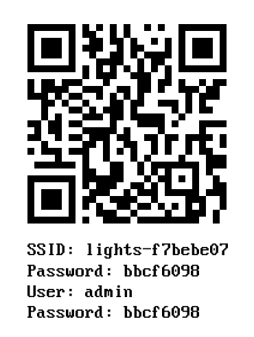

# Decorative-Lights

## Usage

- on stock settings AP esp-lights without any passwd will be created, from here you can configure behaviour of lights
- stock credentials are admin:admin, building spiffs with `-D__CREDENTIALS__` will auto-generate credentials and create img for QR sticker see:
  
- this QR could be used to easily setup lights via Android/IOS phones or [esp-lights.apk](https://github.com/aenniw/esp-lights/releases) could be used to setup/controll lights
- after power-up while blue led is still off pressing reset button will cause WIFI config reset
- short press of button changes light mode \[color/all-rainbow/single-ranbow/all-custom/single/custom/off]
- long press of button adjust brightness of lights

## Used pin-outs

| Wemos D1 | Led Strip | Mode button |
| :------: | :-------: | :---------: |
|    D8    |     -     |      X      |
|   3V3    |     -     |      X      |
|    D4    |   DATA    |      -      |
|    G     |    GND    |      -      |
|    5V    |    +V     |      -      |

## Parts:

- [WeMos-D1-Mini](https://www.ebay.com/itm/ESP8266-ESP-12-WeMos-D1-Mini-WIFI-Dev-Kit-Development-Board-NodeMCU-Lua/292690586703?ssPageName=STRK%3AMEBIDX%3AIT&_trksid=p2057872.m2749.l2649) or [WeMos-D1-Mini Lite](https://www.ebay.com/itm/WEMOS-D1-Mini-Lite-WIFI-V1-0-0-Internet-Development-Board-1MB-Flash-ESP8285/263176521762?epid=873884728&hash=item3d468b0822:g:LI0AAOSwOsBZpp5M) or other solutions based on this processor
- [WS2812 heatsink individually addressable rgb](https://www.aliexpress.com/item/32451310377.html?spm=a2g0s.9042311.0.0.48e54c4dKqa0op)
- [PSU](https://www.ebay.com/itm/EU-Plug-USB-Charger-Travel-Wall-Charger-Adapter-Phone-Charger-for-iPhone-Samsung/132216603822?hash=item1ec8b944ae:m:mPF6wkB17adq9mAsrNkq5BQ)
- [Cable](https://www.ebay.com/itm/100m-Spulen-LiYv-Schaltlitzen-0-25mm-12-Farben-zur-Wahl-Top-Qualitat-aus-DE/323301051643?hash=item4b463e8cfb:m:mp4QPKHYW1K8m40cjoDYQBA)

## 3D printable parts:

- WeMos-Case: [case-base.stl](./models/case-base.stl) [case-cap.stl](./models/case-cap.stl) [button-mode.stl](./models/button-mode.stl) [button-reset.stl](./models/button-reset.stl)
- Lantern: [light-bottom.stl](./models/light-bottom.stl) [light-top.stl](./models/light-top.stl) [led-cover.stl](./models/led-cover.stl) [led-insert.stl](./models/led-insert.stl)

#### Note:

- PSU used for build needs to be adjusted based on used led-strip length
